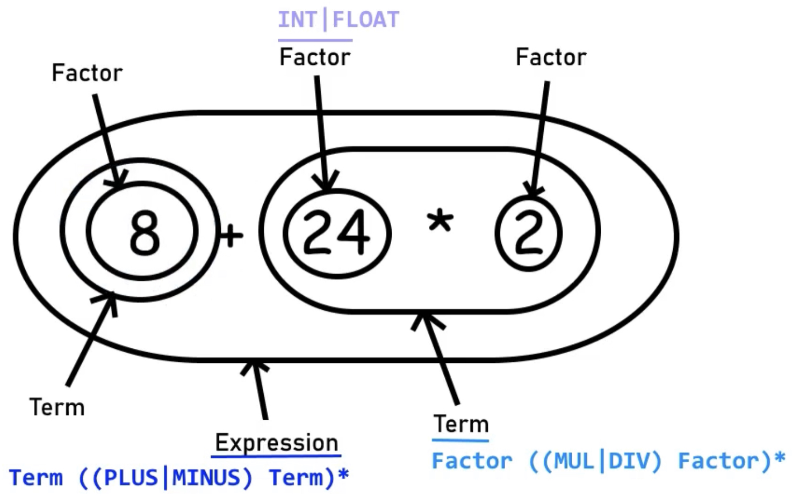

# Lemo-Programming-Language and Interpreter

Small programming language and interpreter, whose design is inspired by BASIC language and is written fully in Rust.

**Author**: Artem Moshnin
Resources used: [Gabriele Tomassetti's blog entries](https://tomassetti.me/resources-create-programming-languages/) with numerous useful resources (Books & Articles)

## Overview

### General information

Programming language supports various fundamental programming concepts such as variable-declaration,
function calling, conditional statements, for and while loops, proper order of operations, recursion and much more.
Multi-line support is integrated, as well as the ability to run external files of '.lemo' format.

TODO: The language syntax is meant to be very readable and intuitive: for instance, every
function body, conditional statement body, and loop body is wrapped in colons; loops
follow a "from [startingNumber] to [endingNumber] with [variable]" syntax; and variable types are
specified upon declaration.

Below is the language's EBNF-based grammar, and following that are some examples of programs that the language can run.
Even further down is a link to a repl.it where the programs can be run.

### Parser

Parser builds up a syntax tree of the program from the tokens created by the Lexer.
The parses has to figure out if the tokens match out language grammar. If it does, generate a tree accordingly.
For example: "200 200 +" makes no sense in our language. While "123 + 456" makes perfect sense.

In other words, order of operations are being followed and the parses construct the syntax tree accordingly to meet its requirements, as illustrated below:

To understand the source code of the parser, I below illustrated the grammar of a mathematical expression that is being analyzed while parsing to ensure that the order of operations are followed:

### Interpreter

The role of the interpreter is to traverse through the AST (Abstract Syntax Tree) that the parser builds, look for different node types and determine what code should be executed. For example, if it comes across a binary operation node with a '+' operator - it will add its left and right child nodes together. The AST (Abstract Syntax Tree) will allow the interpreter to follow the order of operations correctly.

### Steps for implementing new operators

### Variables declaration

### Comparison, Logical Operators and Booleans

**Comparison Operators**: =, !=, <, >, <=, >=

**Logical Operators**: and, or, not
Example of Logical Operators:
5 == 5 and 6 == 6 => 1
1 + 1 == 2 or 2 + 2 == 5 => 1

**Booleans**: 0 = FALSE, 1 = TRUE

## Grammar

  
Grammar (EBNF-based) of the Lemo-Programming Language (click to expand)

    -> Grammar (EBNF-based) of the Lemo-Programming Language <-

    statements : NEWLINE* statement (NEWLINE+ statement)* NEWLINE\*

    statement : KEYWORD:RETURN expr?
    : KEYWORD:CONTINUE
    : KEYWORD:BREAK
    : expr

    expr : KEYWORD:VAR IDENTIFIER EQ expr
    : comp-expr ((KEYWORD:AND|KEYWORD:OR) comp-expr)\*

    comp-expr : NOT comp-expr
    : arith-expr ((EE|LT|GT|LTE|GTE) arith-expr)\*

    arith-expr : term ((PLUS|MINUS) term)\*

    term : factor ((MUL|DIV) factor)\*

    factor : (PLUS|MINUS) factor
    : power

    power : call (POW factor)\*

    call : atom (LPAREN (expr (COMMA expr)\*)? RPAREN)?

    atom : INT|FLOAT|STRING|IDENTIFIER
    : LPAREN expr RPAREN
    : list-expr
    : if-expr
    : for-expr
    : while-expr
    : func-def

    list-expr : LSQUARE (expr (COMMA expr)\*)? RSQUARE

    if-expr : KEYWORD:IF expr KEYWORD:THEN
    (statement if-expr-b|if-expr-c?)
    | (NEWLINE statements KEYWORD:END|if-expr-b|if-expr-c)

    if-expr-b : KEYWORD:ELIF expr KEYWORD:THEN
    (statement if-expr-b|if-expr-c?)
    | (NEWLINE statements KEYWORD:END|if-expr-b|if-expr-c)

    if-expr-c : KEYWORD:ELSE
    statement
    | (NEWLINE statements KEYWORD:END)

    for-expr : KEYWORD:FOR IDENTIFIER EQ expr KEYWORD:TO expr
    (KEYWORD:STEP expr)? KEYWORD:THEN
    statement
    | (NEWLINE statements KEYWORD:END)

    while-expr : KEYWORD:WHILE expr KEYWORD:THEN
    statement
    | (NEWLINE statements KEYWORD:END)

    func-def : KEYWORD:FUN IDENTIFIER?
    LPAREN (IDENTIFIER (COMMA IDENTIFIER)\*)? RPAREN
    (ARROW expr)
    | (NEWLINE statements KEYWORD:END)

## Examples of Working Programs

### Basic Variable Declaration

### Basic Function Calling

### Basic Conditional Statements

### Basic Loops

### Nested Loops

### FizzBuzz

### Recursion and Fibonacci

### Order of Operations

## Repl.it Link
